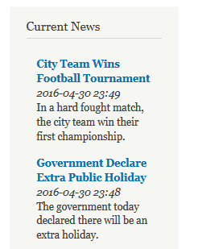

class: center, middle
# Custom Step Definition<br>in Behat and Drupal
### Joseph Chin<br>DrupalCamp Manila<br>May 7, 2016 


---
# Hello
* Joseph Chin
* Drupal Solution Architect since 2007
* Committee Member of the Singapore Drupal Meetup
* jchin1968 on .media-icon[    ]
* Follow along here: https://rawgit.com/jchin1968/presentations/master/2016-05-07_behat/index.html


---
# Today's Topic
.left.left-float[
* Create a Behat test to make sure a news block is current
* Use the Behat Drupal Extension with a custom step definition
]
.right.right-float[]

???
* Verify the latest news is being updated in a timely manner
* This test is a bit contrived since there are probably better ways to test if a feeds importer is working. However, its simplicity let's me focus on the how creating the custom step definition
* Before I begin, some assumptions...
** Familiar with the concept of Behat and BDD (behaviorial driven development)
** Setting up a Behat environment for a specific Drupal site i.e configuring the behat.yml file, drush
** Writing tests using the default step definitions provided in the Drupal Extension
** Running a Behat test
** Basic object-oriented programming

???
* assume user already has a working behat folder with behat.yml, FeatureContext.php and a feature file already created


---
# Update Behat Configuration

behat.yml
```yaml
default:
  suites:
    ...
    ...
  extensions:
    Behat\MinkExtension:
      ...
      ...
    Drupal\DrupalExtension:
      ...
      ...
    region_map:
     news_publish_date: ".view-news .views-row-1 .views-field-created"
```

???
* Don't always need to update. In our case, we added one line to region_map which makes it easier to work with "news_publish_date" instead of messy css selectors


---
# Write Step Definition and Execute

news.feature
```Gherkin
Feature: News is current
  As a user, I should see a block with a list of current news

  @api
  Scenario: Home page should display a list of current news
    Given I am logged in as an "administrator"
    Then I run cron
    When I go to the homepage
    Then I should see the heading "Current News"
    And the datetime in region "news_publish_date" is not older than 4 hours
```

???
* @api indicate should use drupal_api to execute steps
* cron executes the feeds importer to pull in news from an external news source
* The highlighted line contains an unrecognizable step definition


---
# Copy-and-Paste Suggestion into FeatureContext.php

```Php
1 scenario (1 undefined)
5 steps (4 passed, 1 undefined)
0m1.04s (29.71Mb)

--- FeatureContext has missing steps. Define them with these snippets:

    /**
     * @Then the datetime in region :arg1 is not older than :arg2 hours
     */
    public function theDatetimeInRegionIsNotOlderThanHours($arg1, $arg2)
    {
        throw new PendingException();
    }

```

---
# Write Assertion Logic

FeatureContext.php
```php
  /**
   * @Then the datetime in region :region is not older than :hours hours
   */
  public function theDatetimeInRegionIsNotOlderThanHours($region, $hours) {
    // Get the region where a date string is supposed to be
    $region_object = $this->getSession()->getPage()->find('region', $region);
    if (!$region_object) {
      throw new \Exception(sprintf('No region "%s" found on the page %s.',
        $region, $this->getSession()->getCurrentUrl()));
    }

    // Get region date string and convert to unix timestamp
    $date_string = $region_object->getText();
    $timestamp = strtotime($date_string);

    // Compare region and current timestamps  
    if (time() - $timestamp > $hours * 3600) {
     throw new \Exception(sprintf('Datetime in "%s" is older then %s hours',
        $region, $hours));
    }
  }
```
???
* php-doc annotation is used to define the step definition pattern
* arg1 and arg2 can be renamed to something more meaningful
* getSession() method is inherited from a Mink class. Mink is like a browser emulator and it contain methods to analyze the content of an html page
* strtotime() is a php function to convert human-readable dates and times into    


---
# Demo

.center.middle[]

---
# Closing Remarks
* Behat for Drupal 8 is not quite ready for prime time
* Running Behat tests can take a while. Checkout my project, [Beekeeper on Github](https://github.com/jchin1968/beekeeper), for running Behat in parallel using AWS
* You can find these slides here: https://github.com/jchin1968/dcmanila2016-presentation
https://rawgit.com/jchin1968/presentations/master/2015-08-18_bdd


---
# References
* http://behat-drupal-extension.readthedocs.io/en/3.1
* https://www.drupal.org/project/drupalextension
* https://www.previousnext.com.au/blog/custom-step-definitions-drupal-drupalextension-and-behat

---
# Q&amp;A

.center.middle[]

