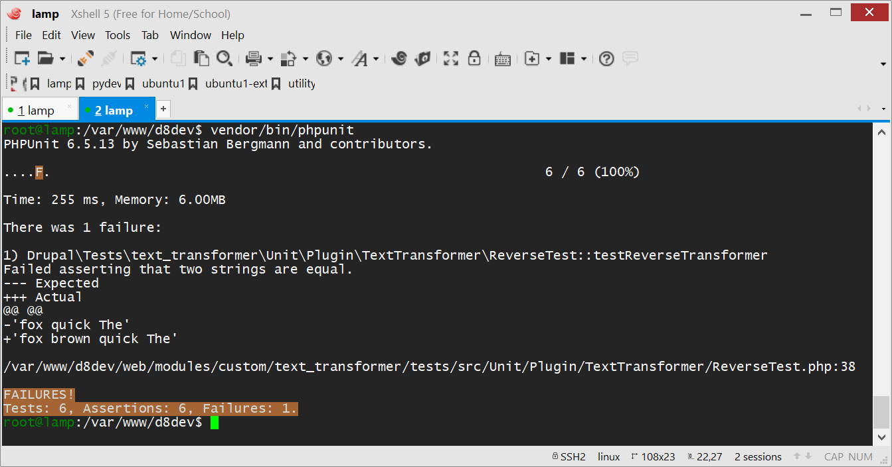

name: cover
class: center, middle
# Drupal 8 Unit Testing
### Joseph Chin<br>Singapore Drupal Meetup<br>October 25, 2018

---
# Hello
- Joseph Chin
- Drupal Solution Architect since 2007
- Singapore Drupal Meetup committee member
- jchin1968 on .media-icon[    ]
- Follow along here: https://rawgit.com/jchin1968/presentations/master/deck/2018-10-25_unit-testing/index.html


---
# Testing In Drupal 8
- SimpleTest
  - Still available in Drupal 8.6 but being deprecated
- PHPUnit
  - Included in Drupal Core. Replaces SimpleTest.
  - Provides Unit, Kernel, Browser and JavaScript testing.
  - Supports both PhantomJS and Selenium
- Behat
  - Available for Drupal 8 and actively maintained
  - Supports both PhantomJS and Selenium
  - Stay tuned for meetups and workshops on the subject!
  
---
# What Is Unit Testing?
- Typically written by a developer during code development
- Test small, discrete units such as a method or a function
- Runs very quickly since Drupal does not need to be loaded

???
- written by developers as opposed to a BA or tester who would be writing behat tests or creating selenium tests 
- Selenium or Behat are for functional testing where the full Drupal site will be loaded.
- Kernel testing which falls between unit and functional tests, will load a small subset of Drupal


---
# When Not To Use Unit Testing
- Method being tested require too many *Test Doubles* i.e. dependencies
 

---
# Use Case
## Take a user inputted sentence and transform it to one of the following:

- Randomly mix the order of the words
- Reverse the order of the words
- Make all the letters uppercase
- Make all the letters lowercase
- Translate it to Pig Latin

---
# Use Case - Sample Result

User Input: The Quick Brown Fox

| Transformer | Output                      |
| :---------- | :-------------------------- |
| Random      | Brown The Fox Quick         |
| Reverse     | Fox Brown Quick The         |
| Lower       | the quick brown fox         |
| Upper       | THE QUICK BROWN FOX         |
| Pig Latin   | heTay uickQay rownBay oxFay |


---
# Use Case - Implementation
- Custom text transformer field attached to an article content type
.text-transformer-field.middle[]

???
- Many different ways to implement this requirement - I chose to create a custom field


---
class: center, middle
# Text Transformer Demonstration


---
# Writing Testable Code - Avoid This
```php

switch ($transformer_type) {
  case 'lower':
     $transformed = strtolower($text);
     break;

  case 'upper':
     $transformed = strtoupper($text);
     break;

  case 'reverse':
    $text_array = explode(' ', $text);
    $reverse_array = array_reverse($text_array);
    $transformed = implode(' ', $reverse_array);
    break;  
}
```

???
- Before you can write tests, your code has to be testable 

---
# Writing Testable Code - Do This
```php
switch ($transformer_type) {
  case 'lower':
     $transformed = new Lower($text);
     break;

  case 'upper':
     $transformed = new Upper($text)
     break;
     
  case 'reverse':
    $transformed = new Reverse($text);
    break;  
}
```

---
# Writing Testable Code - And This
```php
class Reverse extends {
  public __construct($text) {
    $text_array = explode(' ', $text);
    $reverse_array = array_reverse($text_array);
    $reverse_text = implode(' ', $reverse_array);
    return $reverse_text;  
  }
}
```


---
class: center, middle
# Text Transformer Plugin Code Demonstration

???
- don't get too concern with how the field is created or how the transformer plugins are automatically detected
- focus on Text Transformer plugins in src/Plugin/TextTransformer
- notice how each text transformer is a separate class


---
# Setup
- None! Already included by default
- Optional: Create phpunit.xml in Drupal project root with the following:

```xml
<?xml version="1.0" encoding="UTF-8"?>
<phpunit bootstrap="web/core/tests/bootstrap.php" colors="true">
  <testsuites>
    <testsuite name="unit">
      <directory>web/modules/custom/text_transformer/tests</directory>
    </testsuite>
  </testsuites>
</phpunit>
```


---
# Test Directory Structure

```text
text_transformer/
+-- src
¦   +-- Controller
¦   +-- Form
¦   +-- Plugin
¦   ¦   +-- Field
¦   ¦   +-- TextTransformer
¦   ¦       +-- Random.php
¦   ¦       +-- Reverse.php
*+-- tests
*¦   +-- src
*¦       +-- Unit
*¦           +-- Plugin
*¦               +-- TextTransformer
*¦                   +-- RandomTest.php
*¦                   +-- ReverseTest.php
+-- text_transformer.info.yml
+-- text_transformer.module
```


---
# Writing a Test Class
```php
namespace Drupal\Tests\text_transformer\Unit\Plugin\TextTransformer;

use Drupal\text_transformer\Plugin\TextTransformer\Reverse;
use Drupal\Tests\UnitTestCase;

class ReverseTest extends UnitTestCase {
  public function setup() {
  }
  
  public function tearDown() {
  }
  
  public function testReverseTransformer() {
  } 
  
  public function testSomethingElse() {
  } 
}
```
- class name should end in Test
- method name should start with test
- tearDown() not always needed


---
# Extending the Setup Method
```php
public function setUp() {
  $this->textTransformer = new Reverse();
}
```

---
# Extending the Tear Down Method
```php
public function tearDown() {
  unset($this->textTransformer);
}
```
- Generally not required if setup is just plain PHP objects
- Is required if there are open files, sockets, etc.

---
# Writing the Test Method

```php
public function testReverseTransformer() {
  $text = 'The quick brown fox';
  $expected = 'fox brown quick The';
  $actual = $this->textTransformer->transform($text);
  $this->assertEquals($expected, $actual);
}
```

???
- generally just one assert per test but there can be exceptions
- for example, to test if a number is within a range
  - assertGreaterThan($expected, 10);
  - assertLessThan($expected, 100);
-   


---
name: assertions
# Assertions

| Mixed                | Arrays / Object          | Files                           |
| :------------------- | :----------------------- | :------------------------------ |
| assertEquals         | assertArrayEquals                  | assertFileExists                |
| assertGreaterThan    | assertArraySubset        | assertDirectoryExists           |
| assertTrue           | assertCount              | assertIsWritable                |
| assertEmpty          | assertArrayNotHasKey     | assertJsonStringEqualsJsonFile  |
| assertContains       | assertObjectHasAttribute | assertXmlStringNotEqualsXmlFile |
| assertStringEndsWith | assertInstanceOf         | assertStringEqualsFile          |

Full list for PHPUnit 6.5 can be found here: https://phpunit.de/manual/6.5/en/appendixes.assertions.html

---
# Running Tests
- if phpunit.xml is setup, run from project root: 

```markdown
 ./vendor/bin/phpunit
```

- if phpunit.xml is NOT setup, run: 

```markdown
 ./vendor/bin/phpunit ./web/modules/custom/text_transformer
```


---
# Test Results - OK

.phpunit-result-ok.middle[]


---
# Test Results - Error

.phpunit-result-error.middle[]

---
# Data Providers

```php
/*
 * @dataProvider sentenceProvider
 */
public function testPigLatinTransformer(string $text, string $expected) {
  $actual = $this->textTransformer->transform($text);
  $this->assertEquals($expected, $actual);
}

public function sentenceProvider() {
  return [
    //Desc       Original                 Expected       
    'test1' => ['Drupal Rock',           'rupalDay ockRay'],
    'test2' => ['Testing is good',       'estingTay siay oodgay'],
    'test3' => ['Welcome to the meetup', 'elcomeWay otay hetay eetupmay'],
  ];
}
```

???
- other annotations
  - @require
  - @depends
  - @test
  - @group


---
# Warm-Up Exercise
- Install the text_transformer module and run the tests that comes with it
- Get the module from https://github.com/jchin1968/text_transformer

???
- Note you don't actually need to enable the module to run the tests


---
# The Real Exercise
- Create a test for the random text transformer
  - Following the same structure as for LowerTest.php, UpperTest.php, etc.
  - Hints: use ```array_unique()``` and ```$this->assertCount()```
- Run the tests again


---
class: center, middle
# Exercise Solution Demonstration


---
# References
- https://www.drupal.org/docs/8/phpunit
- https://www.lullabot.com/articles/an-overview-of-testing-in-drupal-8
- https://phpunit.de/manual/6.5/en/installation.html
- https://phpunit.readthedocs.io/en/7.4

---
# Q&amp;A

.center.middle[]