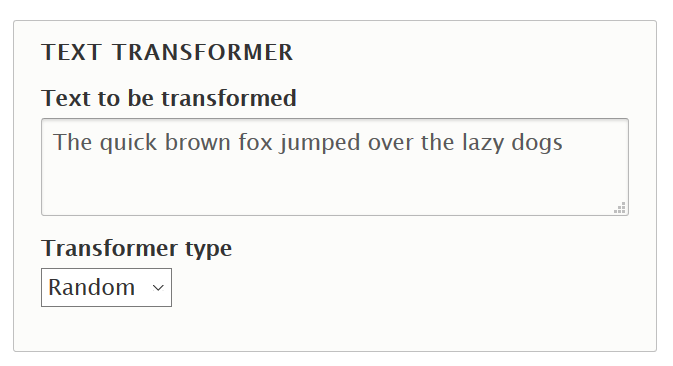

name: cover
class: center, middle
# Drupal 8 Unit Testing
### Joseph Chin<br>Singapore Drupal Meetup<br>October, 2018

---
# Hello
- Joseph Chin
- Drupal Solution Architect since 2007
- Singapore Drupal Meetup committee member
- jchin1968 on .media-icon[    ]
- Follow along here: https://rawgit.com/jchin1968/presentations/master/deck/2018-10_unit-testing/index.html


---
# Testing in Drupal 8
- PHPUnit
  - Now part of Drupal Core. Replaces SimpleTest.
  - Provides Unit, Kernel, Browser and JavaScript testing.
- SimpleTest
  - Still available in Drupal 8.6 but being deprecated
- Behat
  - Available for Drupal 8 and actively maintained
  - Stay tuned for meetups and workshops on the subject!
- Others
  - Selenium, CodeCeption
  
---
# What is Unit Testing?
- Typically written by a developer during code development
- Test small, discrete units such as a method or a function
- Runs very quickly since Drupal does not need to be loaded

???
- written by developers as opposed to a BA or tester who would be writing behat tests or creating selenium tests 
- Selenium or Behat are for functional testing where the full Drupal site will be loaded.
- Kernel testing which falls between unit and functional tests, will load a small subset of Drupal


---
# When Not to Use Unit Testing
- Method being tested require too many *Test Doubles* i.e. dependencies
 

---
# Our Use Case
## Take a user inputted sentence and transform it to one of the following:
- Randomly mix the order of the words
- Reverse the order of the words
- Make all the letters uppercase
- Make all the letters lowercase
- Translate it to Pig Latin

---
name: our-implementation
# Our Implementation
- Custom text transformer field attached to an article content type
.text-transformer-field.middle[]

???
- don't get too concern with how the field is created or how the transformer plugins are automatically detected
- focus on Text Transformer plugins in src/Plugin/TextTransformer

---
# Demo
- Demonstrate the field
- Show the code, specifically the transformer plugins

---
# Writing Testable Code - Avoid This
```php

switch ($transformer_type) {
  case 'lower':
     $transformed = strtolower($text);
     break;

  case 'upper':
     $transformed = strtoupper($text);
     break;

  case 'reverse':
    $text_array = explode(' ', $text);
    $reverse_array = array_reverse($text_array);
    $transformed = implode(' ', $reverse_array);
    break;  
}
```

???
- Before you can write tests, your code has to be testable 

---
# Writing Testable Code - Do This
```php
switch ($transformer_type) {
  case 'lower':
     $transformed = new Lower($text);
     break;

  case 'upper':
     $transformed = new Upper($text)
     break;
     
  case 'reverse':
    $transformed = new Reverse($text);
    break;  
}
```


---
# Test Directory Structure

```text
text_transformer/
+-- src
¦   +-- Controller
¦   +-- Form
¦   +-- Plugin
¦   ¦   +-- Field
¦   ¦   +-- TextTransformer
¦   ¦       +-- Random.php
¦   ¦       +-- Reverse.php
*+-- tests
*¦   +-- src
*¦       +-- Unit
*¦           +-- Plugin
*¦               +-- TextTransformer
*¦                   +-- RandomTest.php
*¦                   +-- ReverseTest.php
+-- text_transformer.info.yml
+-- text_transformer.module
```


---
# Creating a Test Class
```php
class ReverseTest extends UnitTestCase {
  public function setup() {
  }
  
  public function tearDown() {
  }
  
  public function testReverseTransformer() {
  
  } 
}
```


---
# Setup
- Create phpunit.xml with the following:

```xml
<?xml version="1.0" encoding="UTF-8"?>
<phpunit bootstrap="web/core/tests/bootstrap.php" colors="true">
  <testsuites>
    <testsuite name="unit">
      <directory>web/modules/custom/text_transformer/tests</directory>
    </testsuite>
  </testsuites>
</phpunit>
```

---
# Running a Test
- vendor/bin/phpunit


# Exercise
- Create tests for 


---
# References
- https://www.lullabot.com/articles/an-overview-of-testing-in-drupal-8

---
# Q&amp;A

.center.middle[]